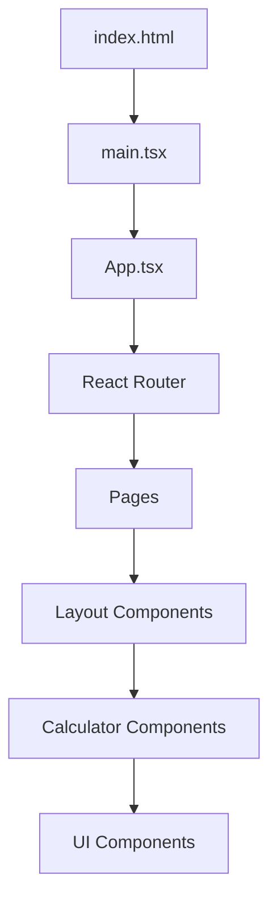
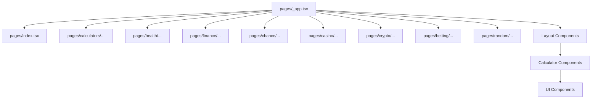
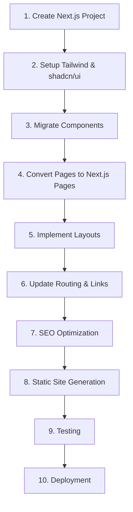
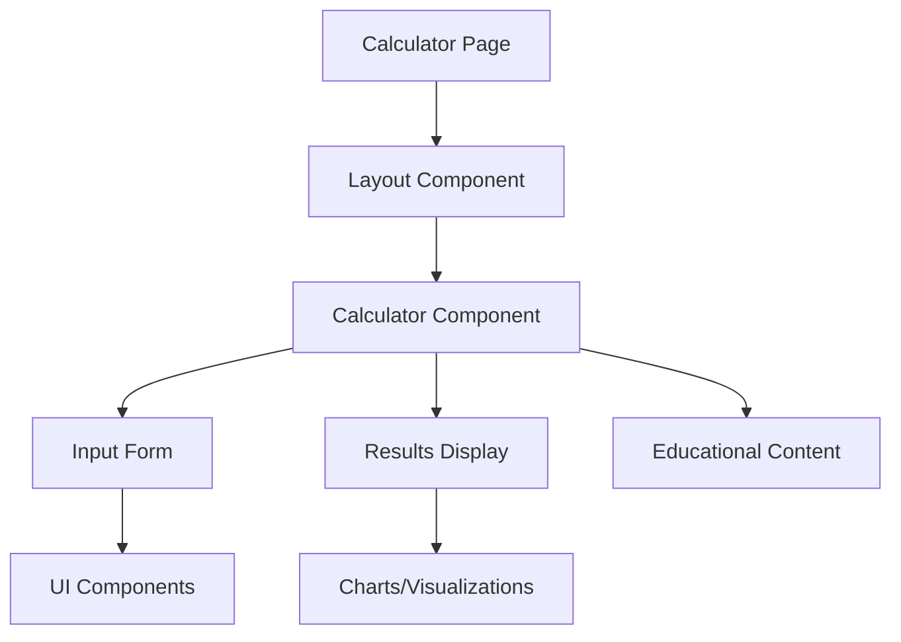

# Money Metrics Mania - React to Next.js Migration Guide

This document provides a comprehensive guide for migrating the Money Metrics Mania calculator application from React (with React Router) to Next.js with static site generation capabilities.

## Table of Contents

1. [Project Overview](#project-overview)
2. [Current Architecture](#current-architecture)
3. [Next.js Architecture](#nextjs-architecture)
4. [File Structure Conversion](#file-structure-conversion)
5. [Routing Migration](#routing-migration)
6. [Component Migration](#component-migration)
7. [Dependencies](#dependencies)
8. [Migration Steps](#migration-steps)
9. [Common Challenges](#common-challenges)

## Project Overview

Money Metrics Mania is a comprehensive web application that offers various calculators and tools across multiple categories:
- Finance calculators (mortgage, savings, budget)
- Math calculators (percentage, discount)
- Health calculators (BMI, calories burned)
- Casino calculators (poker, roulette)
- Crypto calculators (profit, staking)
- Chance games (dice, coin flip, name picker)
- Random tools (stopwatch, timer)
- Betting calculators (odds converter, parlay)

The application currently uses React with React Router for client-side routing.

## Current Architecture



### Key Components

- **App.tsx**: Main application component with React Router setup
- **Layout**: Wrapper components for different page types
- **Pages**: Route components that render calculator interfaces
- **Calculator Components**: Functional components for different calculators
- **UI Components**: Reusable UI elements (buttons, cards, etc.)

## Next.js Architecture



## File Structure Conversion

### Current Structure (Simplified)

```
/src
  /App.tsx
  /main.tsx
  /components
    /ui
    /layout
    /calculators
      /finance
      /health
      /math
      /casino
      /crypto
      /chance-games
      /random
      /betting
  /pages
    /finance
    /health
    /math
    /casino
    /crypto
    /chance
    /random
    /betting
  /hooks
  /lib
```

### Next.js Structure

```
/src
  /pages
    _app.tsx
    _document.tsx
    index.tsx
    /finance
      mortgage-calculator.tsx
      savings-goal-tracker.tsx
      ...
    /health
      bmi-calculator.tsx
      ...
    /math
      percentage-calculator.tsx
      ...
    /casino
      roulette-odds-calculator.tsx
      ...
    /crypto
      crypto-profit-calculator.tsx
      ...
    /chance
      roll-a-dice.tsx
      ...
    /random
      stopwatch-timer.tsx
      ...
    /betting
      odds-converter.tsx
      ...
  /components
    /ui
    /layout
    /calculators
      /finance
      /health
      /math
      /casino
      /crypto
      /chance-games
      /random
      /betting
  /hooks
  /lib
  /styles
```

## Routing Migration

### Current Routing (React Router)

The current application uses React Router with a route configuration in `App.tsx`:

```tsx
<BrowserRouter>
  <Routes>
    <Route path="/" element={<Index />} />
    <Route path="/calculators" element={<CalculatorsPage />} />
    <Route path="/finance/mortgage-calculator" element={<MortgageCalculatorPage />} />
    {/* More routes... */}
  </Routes>
</BrowserRouter>
```

### Next.js Routing

Next.js uses file-based routing. Each file in the `/pages` directory becomes a route:

- `/pages/index.tsx` → `/`
- `/pages/calculators/index.tsx` → `/calculators`
- `/pages/finance/mortgage-calculator.tsx` → `/finance/mortgage-calculator`

## Component Migration

### Layout Components

Current:
```tsx
// Layout.tsx
const Layout = ({ children, showPromo, showSideBanner }) => {
  return (
    <div>
      <TopNav />
      <main>{children}</main>
      <Footer />
    </div>
  );
};

// Page using layout
const MortgageCalculatorPage = () => {
  return (
    <Layout>
      <MortgageCalculator />
    </Layout>
  );
};
```

Next.js:
```tsx
// _app.tsx
function MyApp({ Component, pageProps }) {
  // Use the layout defined at the page level, if available
  const getLayout = Component.getLayout || ((page) => page);

  return getLayout(<Component {...pageProps} />);
}

// layouts/Layout.tsx
const Layout = ({ children }) => {
  return (
    <div>
      <TopNav />
      <main>{children}</main>
      <Footer />
    </div>
  );
};

// pages/finance/mortgage-calculator.tsx
const MortgageCalculatorPage = () => {
  return <MortgageCalculator />;
};

MortgageCalculatorPage.getLayout = (page) => <Layout>{page}</Layout>;
```

### Link Components

Current:
```tsx
import { Link } from 'react-router-dom';

<Link to="/finance/mortgage-calculator">Mortgage Calculator</Link>
```

Next.js:
```tsx
import Link from 'next/link';

<Link href="/finance/mortgage-calculator">Mortgage Calculator</Link>
```

## Dependencies

### Current Dependencies

```json
{
  "dependencies": {
    "@dnd-kit/core": "^6.0.8",
    "@dnd-kit/sortable": "^7.0.2",
    "@radix-ui/react-accordion": "^1.2.0",
    "@tanstack/react-query": "^5.56.2",
    "class-variance-authority": "^0.7.1",
    "clsx": "^2.1.1",
    "date-fns": "^3.6.0",
    "framer-motion": "^12.5.0",
    "lucide-react": "^0.462.0",
    "react": "^18.3.1",
    "react-dom": "^18.3.1",
    "react-helmet": "^6.1.0",
    "react-router-dom": "^6.26.2",
    "recharts": "^2.12.7",
    "sonner": "^1.5.0",
    "tailwind-merge": "^2.5.2",
    "zod": "^3.23.8"
  }
}
```

### Next.js Dependencies

```json
{
  "dependencies": {
    "@dnd-kit/core": "^6.0.8",
    "@dnd-kit/sortable": "^7.0.2",
    "@radix-ui/react-accordion": "^1.2.0", 
    "@tanstack/react-query": "^5.56.2",
    "class-variance-authority": "^0.7.1",
    "clsx": "^2.1.1",
    "date-fns": "^3.6.0",
    "framer-motion": "^12.5.0",
    "lucide-react": "^0.462.0",
    "next": "^13.4.19",
    "react": "^18.3.1",
    "react-dom": "^18.3.1",
    "recharts": "^2.12.7",
    "sonner": "^1.5.0",
    "tailwind-merge": "^2.5.2",
    "zod": "^3.23.8"
  }
}
```

Key changes:
- Added `next` package
- Removed `react-router-dom` package
- Replaced `react-helmet` with Next.js Head component

## Migration Steps



### 1. Create Next.js Project

```bash
npx create-next-app@latest money-metrics-mania-next --typescript
```

### 2. Setup Tailwind & shadcn/ui

```bash
npm install -D tailwindcss postcss autoprefixer
npx tailwindcss init -p

# Install shadcn/ui
npx shadcn-ui@latest init
```

### 3. Migrate Components

- Copy UI components from `/src/components/ui` to the new project
- Copy calculator components from `/src/components/calculators` to the new project
- Copy layout components from `/src/components/layout` to the new project
- Copy utility functions from `/src/lib` to the new project
- Copy hooks from `/src/hooks` to the new project

### 4. Convert Pages to Next.js Pages

For each page in the React app:
1. Create a corresponding file in the `/pages` directory
2. Convert from using React Router to Next.js routing
3. Implement `getStaticProps` for static data

Example:

```tsx
// pages/finance/mortgage-calculator.tsx
import { GetStaticProps } from 'next';
import Head from 'next/head';
import Layout from '@/components/layout/Layout';
import MortgageCalculator from '@/components/calculators/finance/MortgageCalculator';

export default function MortgageCalculatorPage() {
  return (
    <>
      <Head>
        <title>Mortgage Calculator | Money Metrics Mania</title>
        <meta name="description" content="Calculate your mortgage payments, interest, and amortization schedule." />
      </Head>
      <MortgageCalculator />
    </>
  );
}

MortgageCalculatorPage.getLayout = (page) => <Layout>{page}</Layout>;

export const getStaticProps: GetStaticProps = async () => {
  return {
    props: {},
  };
};
```

### 5. Implement Layouts

Create a custom `_app.tsx` file that supports per-page layouts:

```tsx
// pages/_app.tsx
import type { AppProps } from 'next/app';
import type { NextPage } from 'next';
import { ReactElement, ReactNode } from 'react';
import { QueryClient, QueryClientProvider } from '@tanstack/react-query';
import '../styles/globals.css';

const queryClient = new QueryClient();

export type NextPageWithLayout<P = {}, IP = P> = NextPage<P, IP> & {
  getLayout?: (page: ReactElement) => ReactNode;
};

type AppPropsWithLayout = AppProps & {
  Component: NextPageWithLayout;
};

export default function MyApp({ Component, pageProps }: AppPropsWithLayout) {
  // Use the layout defined at the page level, if available
  const getLayout = Component.getLayout ?? ((page) => page);

  return (
    <QueryClientProvider client={queryClient}>
      {getLayout(<Component {...pageProps} />)}
    </QueryClientProvider>
  );
}
```

### 6. Update Routing & Links

Replace all React Router `Link` components with Next.js `Link` components:

```tsx
// Before
import { Link } from 'react-router-dom';
<Link to="/finance/mortgage-calculator">Mortgage Calculator</Link>

// After
import Link from 'next/link';
<Link href="/finance/mortgage-calculator">Mortgage Calculator</Link>
```

### 7. SEO Optimization

Replace React Helmet with Next.js Head component:

```tsx
// Before
import { Helmet } from 'react-helmet';
<Helmet>
  <title>Mortgage Calculator | Money Metrics Mania</title>
  <meta name="description" content="Calculate your mortgage payments." />
</Helmet>

// After
import Head from 'next/head';
<Head>
  <title>Mortgage Calculator | Money Metrics Mania</title>
  <meta name="description" content="Calculate your mortgage payments." />
</Head>
```

### 8. Static Site Generation

Implement `getStaticProps` for pages that need data:

```tsx
export const getStaticProps: GetStaticProps = async () => {
  // Fetch data for the page
  return {
    props: {
      // Your data here
    },
    // Re-generate at most once per hour
    revalidate: 3600,
  };
};
```

For dynamic routes, implement `getStaticPaths`:

```tsx
export const getStaticPaths: GetStaticPaths = async () => {
  return {
    paths: [
      // Pre-rendered paths
    ],
    fallback: 'blocking',
  };
};
```

### 9. Testing

Test all pages and functionality to ensure the migration was successful.

### 10. Deployment

Deploy to a static hosting platform like Vercel, Netlify, or AWS Amplify.

## Common Challenges

### 1. Dynamic Routes

React Router handles dynamic routes with parameters like `/calculator/:id`. In Next.js, these become:
- File: `/pages/calculator/[id].tsx`
- Implementation: Use `getStaticPaths` to pre-render specific paths

### 2. Route Redirects

React Router uses `<Navigate to="/new-url" replace />` for redirects. In Next.js:
- For client-side redirects: Use `useRouter().push('/new-url')`
- For server-side redirects: Use `redirect` in `getStaticProps`

### 3. Nested Layouts

The current app has complex nested layouts. Next.js solution:
- Create layout components that can be nested
- Use the `getLayout` pattern in `_app.tsx`
- Compose layouts in page components

### 4. Client-Side Data Fetching

The current app uses React Query for data fetching. Next.js compatible approach:
- Keep using React Query for client-side data fetching
- Use `getStaticProps` for static data that can be pre-rendered

### 5. Image Optimization

Replace standard `` tags with Next.js Image component:

```tsx
// Before


// After
import Image from 'next/image';
<Image src="/images/logo.png" alt="Logo" width={200} height={50} />
```

## Key Components to Migrate

### Calculator Components

The calculator components are the core of the application and should be migrated with care:



Each calculator follows a similar pattern:
1. An input form for user parameters
2. A calculation engine
3. A results display (often with visualizations)
4. Supporting educational content

### Shared UI Components

The application uses shadcn/ui components extensively. These can be reimplemented in the Next.js application using the same shadcn/ui setup.

## File-by-File Migration Guide

Here's a more detailed guide for migrating specific key files:

### 1. `App.tsx` to `_app.tsx` and Route Files

Current `App.tsx` contains a large React Router configuration. This will be converted to:
- A minimal `_app.tsx` for global configuration
- Individual page files in the `/pages` directory

### 2. `Layout.tsx` to Layout Components

The current `Layout.tsx` will be converted to:
- A base Layout component that can be used by all pages
- Specialized layout components (CryptoLayout, BettingLayout, etc.)

### 3. Index Page

The home page will be converted to `/pages/index.tsx` with static generation for optimal performance.

### 4. Calculator Components

Each calculator component should be migrated with minimal changes to its internal logic, focusing on:
- Updating imports
- Replacing React Router specific code
- Implementing proper Next.js patterns

## Conclusion

This migration guide provides a comprehensive roadmap for converting the Money Metrics Mania React application to a Next.js static site. By following these steps and addressing the common challenges, you can successfully migrate the application while maintaining its functionality and improving performance through static site generation.

The benefits of this migration include:
- Improved SEO through static generation
- Better performance with pre-rendered pages
- Simpler routing through file-based system
- Enhanced image optimization
- Easier deployment to static hosting platforms
